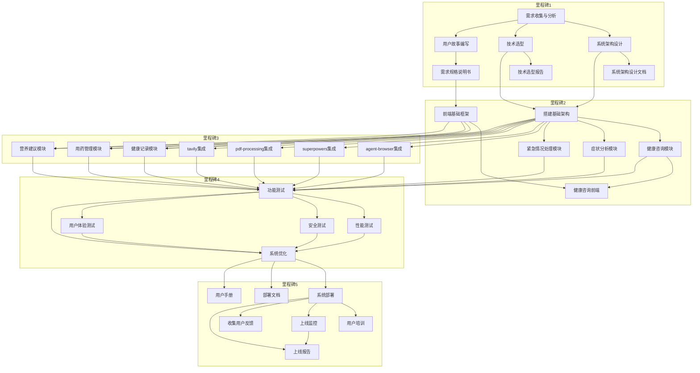

# AI宠物健康助手详细时间表与管理计划

## 1. 项目概述

AI宠物健康助手是一个基于LangChain框架开发的智能系统，旨在为宠物主人提供全面的宠物健康管理服务。系统结合了先进的AI技术和专业的宠物医疗知识，能够回答宠物健康问题、提供健康建议、跟踪健康状况并连接宠物主人与专业兽医。

## 2. 详细时间表

### 2.1 项目时间线
项目总周期：16周（2026年4月15日 - 2026年8月4日）

### 2.2 详细任务分解与时间表

#### 里程碑1：需求分析与设计（第1-2周，4.15-4.28）

| 任务ID | 任务名称 | 开始日期 | 结束日期 | 持续时间 | 负责人 | 依赖关系 | 优先级 | 缓冲时间 |
|--------|----------|----------|----------|----------|--------|----------|--------|----------|
| RQ-001 | 需求收集与分析 | 4.15 | 4.19 | 5天 | 产品经理 | - | 高 | 1天 |
| RQ-002 | 系统架构设计 | 4.15 | 4.22 | 8天 | 后端开发、AI工程师 | RQ-001 | 高 | 1天 |
| RQ-003 | 技术选型 | 4.18 | 4.22 | 5天 | 技术团队 | RQ-001 | 高 | 1天 |
| RQ-004 | 用户故事编写 | 4.19 | 4.25 | 7天 | 产品经理 | RQ-001 | 高 | 1天 |
| RQ-005 | 需求规格说明书编写 | 4.22 | 4.28 | 7天 | 产品经理 | RQ-001, RQ-004 | 高 | 1天 |
| RQ-006 | 系统架构设计文档编写 | 4.23 | 4.28 | 6天 | 后端开发 | RQ-002 | 高 | 1天 |
| RQ-007 | 技术选型报告编写 | 4.23 | 4.28 | 6天 | 技术团队 | RQ-003 | 高 | 1天 |

#### 里程碑2：核心功能开发（第3-6周，4.29-5.26）

| 任务ID | 任务名称 | 开始日期 | 结束日期 | 持续时间 | 负责人 | 依赖关系 | 优先级 | 缓冲时间 |
|--------|----------|----------|----------|----------|--------|----------|--------|----------|
| DEV-001 | 搭建基础架构 | 4.29 | 5.12 | 14天 | 后端开发 | RQ-002, RQ-003 | 高 | 2天 |
| DEV-002 | 健康咨询模块开发 | 5.2 | 5.19 | 14天 | AI工程师、后端开发 | DEV-001 | 高 | 2天 |
| DEV-003 | 症状分析模块开发 | 5.9 | 5.26 | 14天 | AI工程师、后端开发 | DEV-001 | 高 | 2天 |
| DEV-004 | 紧急情况处理模块开发 | 5.16 | 5.26 | 11天 | 后端开发 | DEV-001 | 高 | 1天 |
| DEV-005 | 前端基础框架搭建 | 4.29 | 5.12 | 14天 | 前端开发 | RQ-005 | 高 | 2天 |
| DEV-006 | 健康咨询前端开发 | 5.13 | 5.26 | 14天 | 前端开发 | DEV-005, DEV-002 | 高 | 2天 |

#### 里程碑3：插件集成与辅助功能（第7-10周，5.27-6.23）

| 任务ID | 任务名称 | 开始日期 | 结束日期 | 持续时间 | 负责人 | 依赖关系 | 优先级 | 缓冲时间 |
|--------|----------|----------|----------|----------|--------|----------|--------|----------|
| INT-001 | agent-browser插件集成 | 5.27 | 6.2 | 7天 | 后端开发 | DEV-001 | 中 | 1天 |
| INT-002 | superpowers插件集成 | 6.3 | 6.9 | 7天 | 后端开发 | DEV-001 | 中 | 1天 |
| INT-003 | pdf-processing插件集成 | 6.10 | 6.16 | 7天 | 后端开发 | DEV-001 | 中 | 1天 |
| INT-004 | tavily插件集成 | 6.17 | 6.23 | 7天 | 后端开发 | DEV-001 | 中 | 1天 |
| DEV-007 | 健康记录模块开发 | 5.27 | 6.16 | 21天 | 后端开发、前端开发 | DEV-001, DEV-005 | 中 | 2天 |
| DEV-008 | 用药管理模块开发 | 6.3 | 6.23 | 21天 | 后端开发、前端开发 | DEV-001, DEV-005 | 中 | 2天 |
| DEV-009 | 营养建议模块开发 | 6.10 | 6.23 | 14天 | 后端开发、前端开发 | DEV-001, DEV-005 | 中 | 2天 |

#### 里程碑4：测试与优化（第11-14周，6.24-7.21）

| 任务ID | 任务名称 | 开始日期 | 结束日期 | 持续时间 | 负责人 | 依赖关系 | 优先级 | 缓冲时间 |
|--------|----------|----------|----------|----------|--------|----------|--------|----------|
| TST-001 | 功能测试 | 6.24 | 7.7 | 14天 | 测试工程师 | DEV-002, DEV-003, DEV-004, DEV-007, DEV-008, DEV-009, INT-001, INT-002, INT-003, INT-004 | 高 | 2天 |
| TST-002 | 性能测试 | 7.1 | 7.14 | 14天 | 测试工程师、运维工程师 | TST-001 | 中 | 2天 |
| TST-003 | 安全测试 | 7.8 | 7.21 | 14天 | 测试工程师 | TST-001 | 中 | 2天 |
| TST-004 | 用户体验测试 | 7.1 | 7.14 | 14天 | 测试工程师、产品经理 | TST-001 | 中 | 2天 |
| OPT-001 | 系统优化 | 6.24 | 7.21 | 28天 | 技术团队 | TST-001, TST-002, TST-003, TST-004 | 高 | 3天 |

#### 里程碑5：部署与上线（第15-16周，7.22-8.4）

| 任务ID | 任务名称 | 开始日期 | 结束日期 | 持续时间 | 负责人 | 依赖关系 | 优先级 | 缓冲时间 |
|--------|----------|----------|----------|----------|--------|----------|--------|----------|
| DEP-001 | 系统部署 | 7.22 | 7.28 | 7天 | 运维工程师 | OPT-001 | 高 | 1天 |
| DEP-002 | 用户培训 | 7.25 | 7.31 | 7天 | 产品经理 | DEP-001 | 中 | 1天 |
| DEP-003 | 上线监控 | 7.29 | 8.4 | 7天 | 运维工程师 | DEP-001 | 高 | 1天 |
| DEP-004 | 收集用户反馈 | 7.29 | 8.4 | 7天 | 产品经理 | DEP-001 | 中 | 1天 |
| DOC-001 | 系统部署文档编写 | 7.22 | 7.28 | 7天 | 运维工程师 | OPT-001 | 中 | 1天 |
| DOC-002 | 用户手册编写 | 7.22 | 7.28 | 7天 | 产品经理 | OPT-001 | 中 | 1天 |
| DOC-003 | 上线报告编写 | 7.30 | 8.4 | 5天 | 项目经理 | DEP-001, DEP-003 | 中 | 1天 |

## 3. 任务依赖关系

### 3.1 依赖关系图

### 3.2 关键路径

关键路径：
1. RQ-001 → RQ-002 → DEV-001 → DEV-002 → TST-001 → OPT-001 → DEP-001 → DEP-003 → DOC-003
2. RQ-001 → RQ-002 → DEV-001 → DEV-003 → TST-001 → OPT-001 → DEP-001 → DEP-003 → DOC-003

## 4. 进度跟踪机制

### 4.1 日常跟踪

- **每日站会**：15分钟，团队成员同步进度和问题
- **任务看板**：使用项目管理工具（如Jira）维护任务状态
- **燃尽图**：每日更新，跟踪迭代进度

### 4.2 周度跟踪

- **周会**：每周一次，讨论项目整体进展和问题
- **周报**：每周五提交，包括进度、问题、风险和下周计划
- **偏差分析**：分析实际进度与计划的偏差，及时调整

### 4.3 里程碑跟踪

- **里程碑评审会议**：每个里程碑结束时，评估里程碑完成情况
- **里程碑报告**：详细记录里程碑完成情况、成果和问题

## 5. 报告流程

### 5.1 内部报告

| 报告类型 | 频率 | 责任人 | 内容 | 分发对象 |
|----------|------|--------|------|----------|
| 每日站会记录 | 每日 | 项目经理 | 进度、问题、风险 | 团队成员 |
| 周报 | 每周五 | 项目经理 | 周进度、问题、风险、下周计划 | 团队成员、stakeholders |
| 里程碑报告 | 每个里程碑 | 项目经理 | 里程碑完成情况、成果、问题 | 团队成员、stakeholders、客户 |
| 风险报告 | 每周 | 项目经理 | 风险识别、评估、应对措施 | 团队成员、stakeholders |
| 质量报告 | 每两周 | 测试工程师 | 测试结果、质量指标、问题 | 团队成员、项目经理 |

### 5.2 外部报告

| 报告类型 | 频率 | 责任人 | 内容 | 分发对象 |
|----------|------|--------|------|----------|
| 项目状态报告 | 每月 | 项目经理 | 项目整体状态、进度、风险 | 高层管理者、客户 |
| 上线报告 | 项目结束 | 项目经理 | 上线情况、成果、后续计划 | 高层管理者、客户 |

## 6. 风险管理计划

### 6.1 风险识别与评估

| 风险ID | 风险描述 | 影响程度 | 可能性 | 风险值 | 应对策略 | 责任人 | 监控频率 |
|--------|----------|----------|----------|--------|----------|--------|----------|
| R1 | 数据隐私问题 | 高 | 中 | 高 | 1. 采用加密存储和传输 2. 严格遵守数据隐私法规 3. 定期进行安全审计 | 后端开发、测试工程师 | 每周 |
| R2 | 医疗建议准确性 | 高 | 中 | 高 | 1. 建立专业的宠物医疗知识库 2. 定期更新和验证知识 3. 明确系统建议的局限性 | AI工程师、产品经理 | 每周 |
| R3 | 系统性能问题 | 中 | 低 | 中 | 1. 优化系统架构 2. 采用分布式处理和缓存机制 3. 进行性能测试和优化 | 后端开发、运维工程师 | 每两周 |
| R4 | 用户体验问题 | 中 | 中 | 中 | 1. 进行用户测试 2. 持续优化界面和交互流程 3. 收集用户反馈并快速响应 | 前端开发、产品经理 | 每两周 |
| R5 | 外部系统集成问题 | 中 | 低 | 中 | 1. 建立标准化的API接口 2. 进行充分的集成测试 3. 制定容错机制 | 后端开发 | 每两周 |
| R6 | 技术依赖风险 | 中 | 低 | 中 | 1. 评估技术依赖的稳定性 2. 制定备选方案 3. 保持技术栈的更新 | 技术团队 | 每月 |
| R7 | 项目延期风险 | 中 | 中 | 中 | 1. 制定详细的项目计划 2. 定期监控进度 3. 及时调整资源分配 | 项目经理 | 每周 |
| R8 | 团队成员变动 | 中 | 低 | 中 | 1. 建立知识共享机制 2. 文档化关键流程 3. 交叉培训团队成员 | 项目经理 | 每月 |
| R9 | 预算超支风险 | 中 | 低 | 中 | 1. 详细的预算规划 2. 定期监控支出 3. 严格的变更控制 | 项目经理 | 每月 |

### 6.2 风险应对策略

#### 高风险应对策略

1. **数据隐私问题**：
   - 实施端到端加密
   - 制定数据处理协议
   - 定期进行安全审计
   - 建立数据泄露应急预案

2. **医疗建议准确性**：
   - 与专业兽医合作验证知识
   - 建立知识更新机制
   - 在系统中明确标注建议的局限性
   - 提供专业兽医咨询渠道

#### 中风险应对策略

1. **系统性能问题**：
   - 进行负载测试
   - 优化数据库查询
   - 实施缓存机制
   - 准备扩容方案

2. **用户体验问题**：
   - 进行用户测试
   - 收集用户反馈
   - 快速迭代优化
   - 建立用户体验指标体系

3. **外部系统集成问题**：
   - 建立标准化API接口
   - 进行充分的集成测试
   - 制定容错机制
   - 准备备选方案

4. **技术依赖风险**：
   - 评估技术依赖的稳定性
   - 制定备选方案
   - 保持技术栈的更新
   - 建立技术债务管理机制

5. **项目延期风险**：
   - 制定详细的项目计划
   - 定期监控进度
   - 及时调整资源分配
   - 建立缓冲区

6. **团队成员变动**：
   - 建立知识共享机制
   - 文档化关键流程
   - 交叉培训团队成员
   - 建立团队凝聚力

7. **预算超支风险**：
   - 详细的预算规划
   - 定期监控支出
   - 严格的变更控制
   - 建立预算预警机制

## 7. 团队资源管理

### 7.1 团队成员技能与工作量

| 角色 | 成员 | 技能专长 | 工作量分配 | 备注 |
|------|------|----------|------------|------|
| 产品经理 | PM1 | 需求分析、产品规划 | 32人天 | 全程参与 |
| 项目经理 | PM2 | 项目管理、风险监控 | 32人天 | 全程参与 |
| 前端开发 | FE1 | React、移动端开发 | 32人天 | 负责移动应用 |
| 前端开发 | FE2 | Vue、Web开发 | 32人天 | 负责Web应用 |
| 后端开发 | BE1 | Python、API开发 | 32人天 | 负责核心功能 |
| 后端开发 | BE2 | 数据库、系统架构 | 32人天 | 负责架构设计 |
| AI工程师 | AI1 | NLP、机器学习 | 32人天 | 负责AI模型集成 |
| 测试工程师 | TE1 | 功能测试、性能测试 | 32人天 | 从迭代3开始参与 |
| 运维工程师 | OE1 | 部署、监控 | 16人天 | 从迭代6开始参与 |

### 7.2 资源分配原则

1. **技能匹配**：根据团队成员的技能专长分配任务
2. **工作量平衡**：确保每个团队成员的工作量合理，避免过载
3. **交叉培训**：鼓励团队成员学习其他领域的知识，提高团队整体能力
4. **资源预留**：为关键任务预留资源，确保项目顺利进行
5. **动态调整**：根据项目进展和团队情况，动态调整资源分配

## 8. 缓冲时间管理

### 8.1 缓冲时间设置

- **任务缓冲**：每个任务设置10-15%的缓冲时间
- **阶段缓冲**：每个里程碑设置1周的缓冲时间
- **项目缓冲**：整个项目设置2周的缓冲时间

### 8.2 缓冲时间使用原则

1. **优先使用任务缓冲**：任务延期首先使用任务自身的缓冲时间
2. **阶段缓冲使用**：当任务缓冲耗尽时，使用阶段缓冲
3. **项目缓冲使用**：当阶段缓冲耗尽时，使用项目缓冲
4. **缓冲时间监控**：定期监控缓冲时间的使用情况，及时调整计划
5. **缓冲时间补充**：如果项目进展顺利，可适当补充缓冲时间

## 9. 项目沟通计划

### 9.1 沟通渠道

| 沟通对象 | 沟通方式 | 沟通频率 | 责任人 | 工具 |
|----------|----------|----------|--------|------|
| 团队成员 | 每日站会 | 每日 | 项目经理 | 视频会议 |
| 团队成员 | 周会 | 每周 | 项目经理 | 视频会议 |
| 团队成员 | 迭代会议 | 每两周 | 项目经理 | 视频会议 |
| Stakeholders | 项目周报 | 每周 | 项目经理 | 邮件 |
| Stakeholders | 里程碑汇报 | 每个里程碑 | 项目经理 | 视频会议 |
| 客户 | 需求确认 | 按需 | 产品经理 | 视频会议 |
| 客户 | 产品演示 | 每个里程碑 | 产品经理 | 视频会议 |
| 供应商 | 技术协调 | 按需 | 技术负责人 | 邮件、视频会议 |

### 9.2 沟通工具

- **项目管理工具**：Jira，用于任务管理和进度跟踪
- **即时通讯工具**：企业微信，用于日常沟通和问题解决
- **文档管理系统**：Confluence，用于文档共享和版本控制
- **代码管理工具**：Git，用于代码版本控制
- **视频会议工具**：腾讯会议，用于远程会议和演示

## 10. 项目变更管理

### 10.1 变更流程

1. **变更申请**：提交变更请求，说明变更原因、影响和建议方案
2. **变更评估**：评估变更的必要性、可行性和影响
3. **变更审批**：根据变更的影响程度，由相应级别审批
4. **变更实施**：实施变更并记录变更内容
5. **变更验证**：验证变更是否达到预期效果

### 10.2 变更控制

- **变更控制委员会（CCB）**：由项目经理、产品经理、技术负责人组成
- **变更管理流程**：严格按照变更流程处理变更请求
- **变更记录**：记录所有变更请求和处理结果
- **变更影响评估**：评估变更对项目进度、质量和成本的影响
- **变更沟通**：及时沟通变更内容和影响

## 11. 项目收尾计划

### 11.1 收尾活动

1. **系统上线**：完成系统部署和上线
2. **用户反馈收集**：收集用户反馈，持续优化系统
3. **项目总结**：进行项目总结和经验教训分析
4. **文档整理**：完成项目文档整理和归档
5. **团队绩效评估**：评估团队成员的绩效

### 11.2 交付物

- **系统源代码**：完整的系统源代码
- **系统部署文档**：详细的部署指南
- **用户手册**：用户使用指南
- **测试报告**：详细的测试结果
- **项目总结报告**：项目总结和经验教训

## 12. 结论

本详细时间表与管理计划为AI宠物健康助手项目提供了全面的指导，包括详细的任务分解、时间安排、依赖关系、进度跟踪机制、报告流程和风险管理计划。通过合理的任务分配、缓冲时间设置和风险管理，确保项目能够按时、高质量地完成。

项目团队将严格按照本计划执行，定期监控进度和风险，及时调整计划，确保项目目标的实现。